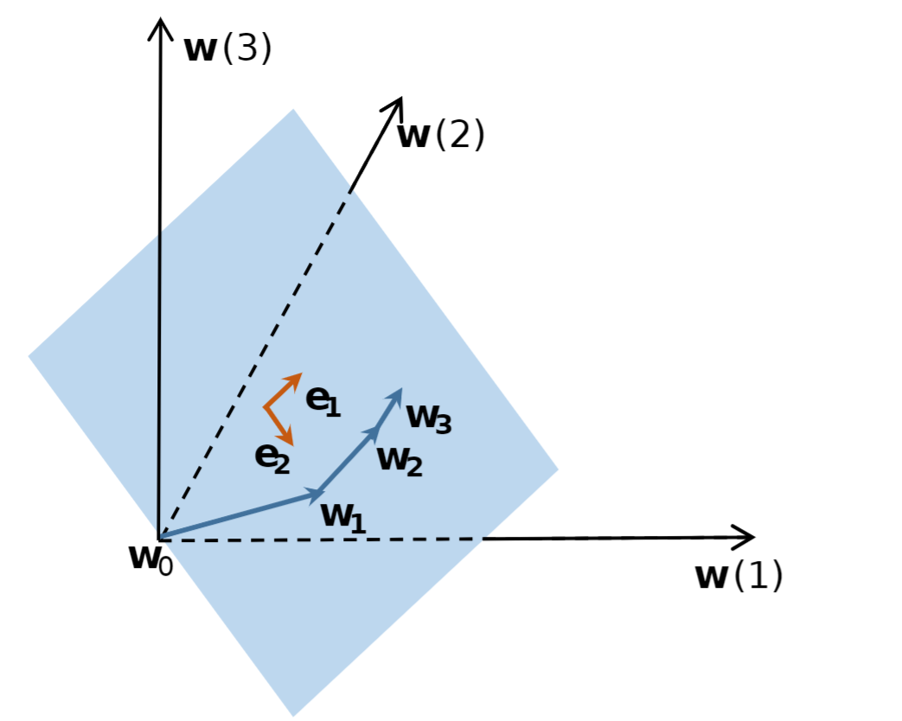

# DLDR

This repository is the official implementation of **Low Dimensional Trajectory Hypothesis is True: DNNs can be Trained in Tiny Subspaces**.

## Abstrat

Deep neural networks (DNNs) usually contain massive parameters, but there is redundancy such that it is guessed that they could be trained in low-dimensional subspaces. In this paper, we propose a Dynamic Linear Dimensionality Reduction (DLDR) based on the low-dimensional properties of the training trajectory. The reduction method is efficient, supported by comprehensive experiments: optimizing DNNs in 40-dimensional spaces can achieve comparable performance as regular training over thousands or even millions of parameters. Since there are only a few variables to optimize, we develop an efficient quasi-Newton-based algorithm, obtain robustness to label noise and also improve the performance of well-trained models, which are three follow-up experiments to show the advantages of finding such low-dimensional subspaces.



## Requirements

The environment requires:

+ python 3.6
+ pytorch 1.4.0
+ CUDA Version 10.0.130

## Usage

We provide training examples in `run.sh`(take CIFAR experiments for example):

```bash
# CIFAR experiments
# Label noise levels
c=0.2
datasets=CIFAR10
for model in resnet20
do
    CUDA_VISIBLE_DEVICES=0 python -u train_sgd.py --datasets $datasets --lr 0.1 --corrupt $c --arch=$model --epochs=150  --save-dir=save_labelnoise$c\_$model |& tee -a log_$model
    
    CUDA_VISIBLE_DEVICES=0 python -u train_pbfgs.py --epochs 20 --datasets $datasets --corrupt $c --params_start 0 --params_end 81  --batch-size 1024   --n_components 40 --arch=$model  --save-dir=save_labelnoise$c\_$model |& tee -a log_$model 

    CUDA_VISIBLE_DEVICES=0 python -u train_psgd.py --epochs 40 --datasets $datasets --lr 1 --corrupt $c --params_start 0 --params_end 81  --batch-size 128  --n_components 40 --arch=$model  --save-dir=save_labelnoise$c\_$model |& tee -a log_$model 
done
```

1. enter directory

   ```bash
   $ cd DLDR
   ```
   
2. run the demo

   ```bash
   $ ./run.sh
   
   ```

Specifically, the demo consists of two steps:

The first step is performing DLDR sampling using regular optimizer (e.g., SGD):

```bash
$ CUDA_VISIBLE_DEVICES=0 python -u train_sgd.py --datasets $datasets --lr 0.1 --corrupt $c --arch=$model --epochs=200  --save-dir=save_labelnoise$c\_$model |& tee -a log_$model
```

You can set `randomseed` and total training epochs `epochs` by yourself. By default, we will sample the model parameters after every epoch training.

The second step is training the *independent* variables obtained from DLDR from the same initialization of the model:

```bash
$ CUDA_VISIBLE_DEVICES=0 python -u train_pbfgs.py --epochs 20 --datasets $datasets --corrupt $c --params_start 0 --params_end 81  --batch-size 1024   --n_components 40 --arch=$model  --save-dir=save_labelnoise$c\_$model |& tee -a log_$model 
```

where `epochs`  denotes the total training epochs for P-BFGS algorithm, `params_start` denotes where our DLDR sampling begins and `params_end` denotes where DLDR sampling stops. `n_components` is the number of variables we use.

We can set the `datasets` among CIFAR10 and CIFAR100. The label noise level `c` is a real number in the range `[0, 1]`.

